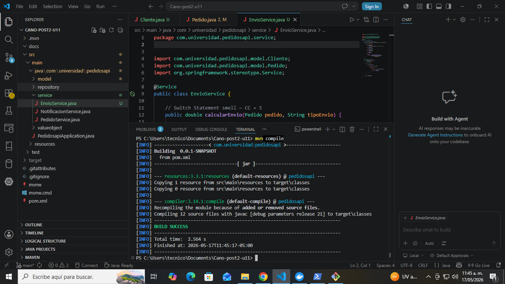
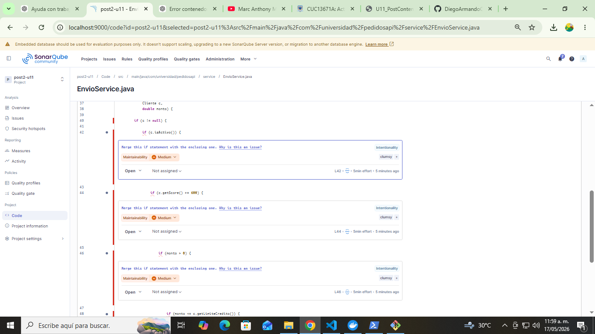
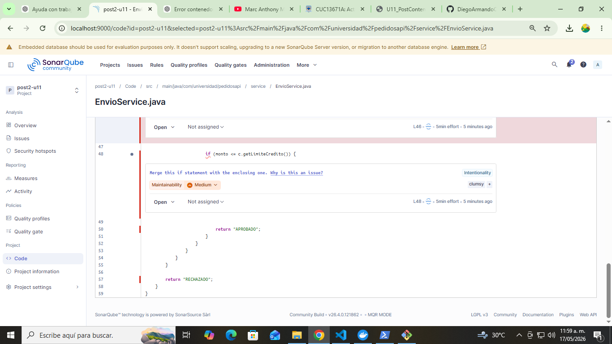
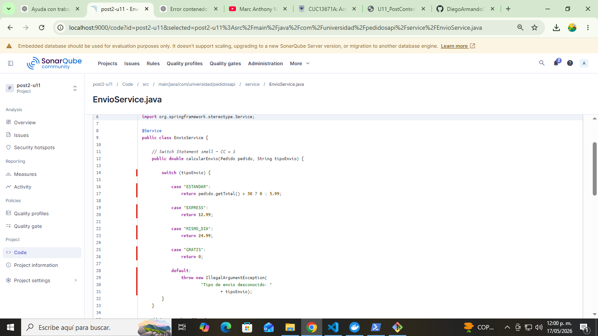
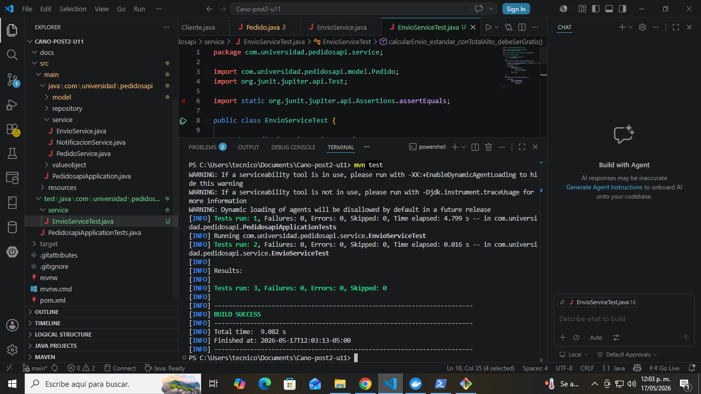
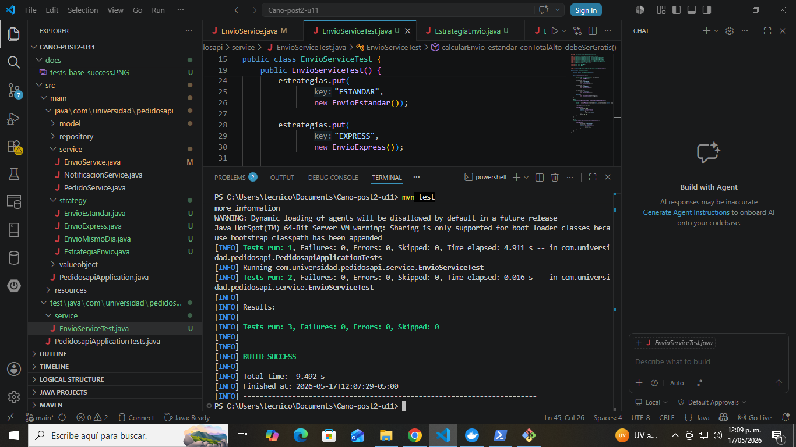

# Post-Contenido 2 — Refactorización Avanzada y Clean Code Profundo

Proyecto desarrollado para la asignatura **Patrones de Diseño de Software** en la unidad de **Refactorización Avanzada y Clean Code Profundo**.

---

# Objetivo

Refactorizar condicionales complejos de alta complejidad ciclomatica aplicando:

- Replace Conditional with Polymorphism
- Guard Clauses

Verificando mediante SonarQube la reducción de complejidad y la mejora de mantenibilidad del proyecto.

---

# Tecnologías Utilizadas

- Java 17
- Spring Boot
- Maven
- SonarQube
- Docker
- JUnit 5

---

# Code Smells Detectados

Durante el análisis inicial se identificaron los siguientes problemas:

- Switch Statement Smell
- Arrow Code
- Alta complejidad ciclomatica
- Condicionales anidados
- Violación del principio Open/Closed

---

# Refactorizaciones Aplicadas

## 1. Replace Conditional with Polymorphism

Se eliminó el `switch` del método `calcularEnvio()` implementando el patrón Strategy.

### Interfaz Strategy

```java
public interface EstrategiaEnvio {
    double calcularCosto(Pedido pedido);
}
```

### Implementaciones creadas

- EnvioEstandar
- EnvioExpress
- EnvioMismoDia

### Beneficios

- Eliminación del Switch Statement Smell
- Código extensible
- Cumplimiento del principio Open/Closed
- Menor complejidad ciclomatica

---

## 2. Guard Clauses

El método `aprobarCredito()` originalmente tenía múltiples condicionales anidados.

Se refactorizó utilizando Guard Clauses:

```java
if (c == null) return "RECHAZADO";
if (!c.isActivo()) return "RECHAZADO";
if (c.getScore() < 600) return "RECHAZADO";
if (monto <= 0) return "RECHAZADO";
if (monto > c.getLimiteCredito()) return "RECHAZADO";

return "APROBADO";
```

### Beneficios

- Eliminación del Arrow Code
- Código más legible
- Menor complejidad ciclomatica
- Mejor mantenibilidad

---

# Pruebas Unitarias

Se implementaron pruebas unitarias con JUnit 5 antes de realizar la refactorización para garantizar que el comportamiento del sistema no cambiara.

Las pruebas siguieron pasando correctamente después de la refactorización.

---

# Comparación de Métricas

| Método | Antes | Después |
|---|---|---|
| calcularEnvio() | CC = 5 | CC = 1 |
| aprobarCredito() | CC = 6 | CC = 2 |

---

# Evidencias

## Código inicial con smells



---

## Complejidad inicial del proyecto



---

## Complejidad inicial detectada por SonarQube



---

## Método calcularEnvio() antes de refactorizar



---

## EnvioService antes de refactorización


---

## Pruebas base exitosas



---

## Pruebas exitosas después de refactorizar



---

# Principio Open/Closed

La implementación del patrón Strategy permitió que el sistema quedara abierto para extensión pero cerrado para modificación. Ahora es posible agregar nuevos tipos de envío creando nuevas implementaciones de `EstrategiaEnvio` sin modificar `EnvioService`. Esto reduce el riesgo de introducir errores y facilita el mantenimiento del código.

---

# Checkpoints Cumplidos

- Interfaz `EstrategiaEnvio` implementada
- Mínimo 3 estrategias creadas
- Uso de inyección por constructor con `Map<String, EstrategiaEnvio>`
- Refactorización con Guard Clauses aplicada
- Pruebas unitarias funcionando
- Reducción de complejidad ciclomatica
- SonarQube detecta menos problemas
- Código más mantenible y legible

---

# Commits Realizados

```bash
pruebas base y codigo inicial con smells
refactorizacion con polimorfismo strategy
refactorizacion con guard clauses
```

---

# Estructura del Proyecto

```plaintext
Cano-post2-u11/
│
├── docs/
│   ├── codigo_smells_compile.PNG
│   ├── complejidad_inicial1.PNG
│   ├── complejidad_inicial2.PNG
│   ├── complejidad_inicial_calcularEnvio.PNG
│   ├── complejidad_inicial_envio_service.PNG
│   ├── tests_base_success.PNG
│   └── tests_refactor_success.PNG
│
├── src/
├── README.md
└── pom.xml
```

---

# Conclusión

La refactorización permitió eliminar condicionales complejos y mejorar significativamente la mantenibilidad del proyecto. El uso de Strategy Pattern redujo la dependencia de estructuras `switch`, mientras que Guard Clauses eliminó el Arrow Code y simplificó la lógica de negocio. SonarQube permitió validar objetivamente la reducción de complejidad y la mejora de calidad del código.
